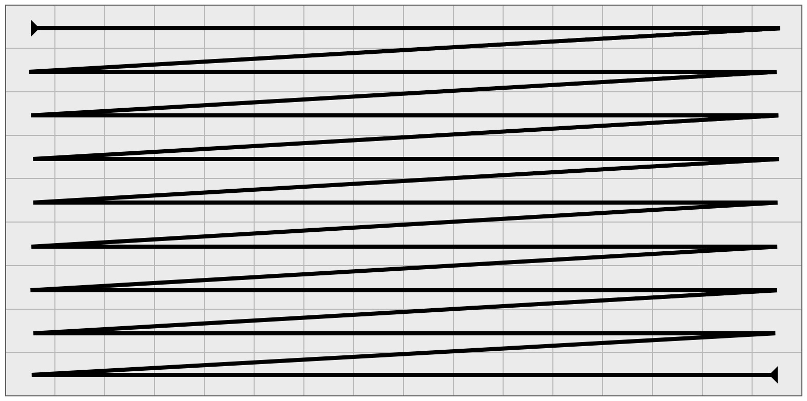
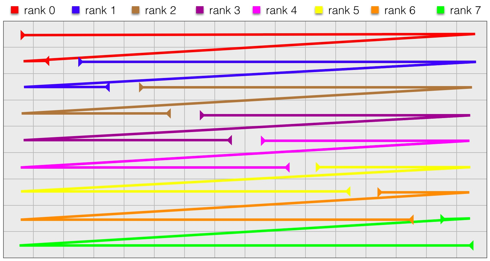
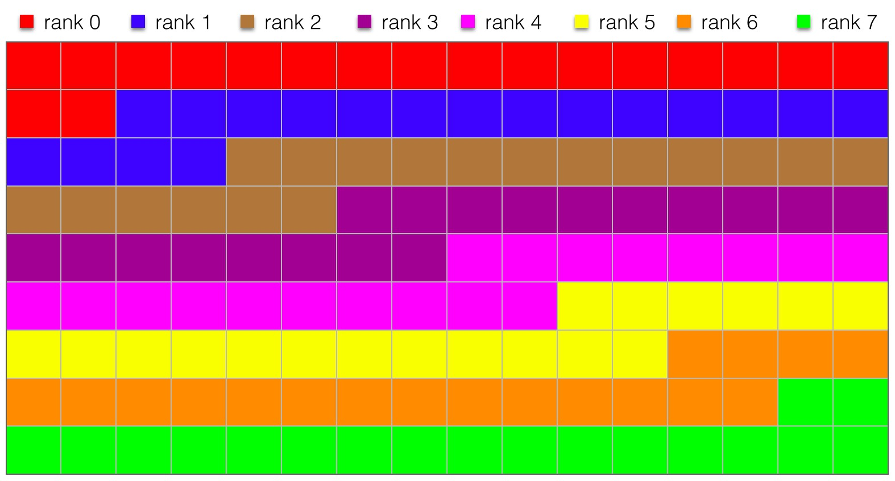

Massively parallel image compositing
======================================

This is a technical follow-up on my short piece about `interactive
supercomputing <http://tailvega.com/hpc005.html>`_. Here I focus on challenges
we faced, and the solution which allowed us to scale the visualization engine
to thousand of GPUs while maintaining a good degree of interactivity.

Parallel image compositing is one of the final stages of sort-last parallel
rendering, in which the partial images from separate rendering workers are
being blended into the final image. This is both compute and communication
heavy rendering steps, which is absent when image is rendered on a single
worker.

* `Naive parallel composition`_

  + `Simple implementation`_

* `Optimized parallel composition`_
* `Pipelining`_

Naive parallel composition
-------------------------------

The simplest way to think about the parallel image compositing is to realize
that each parallel processor can compose a fixed set of pixels. With a given
image resolution, the number of pixels decreases linearly with the processor
count as :math:`N_{\rm pix} = \frac{W\times\,H}{N_{\rm comp}}`, where :math:`W`
and :math:`H` are image width and height respectively, and :math:`N_{\rm comp}`
is the number of compositing workers. The amount of data that each worker
received from remote renderers scales inversely with the number of workers,
thus this simple parallel algorithms has a natural strong scalability, at least
in theory. In practice, we are likely to be limited by the interconnect
latency, however.

Simple implementation
^^^^^^^^^^^^^^^^^^^^^^

In this section I will show a simple naive implementation of the parallel
compositing algorithm, that shows good strong scalability in practice. We will
use the following interface

.. code-block:: c++

   void parallelCompositingNaive(
      std::shared_ptr<float4> src,
      std::shared_ptr<float4> dst,
      const int npixels,
      const MPI_Comm &comm,
      const std::vector<int> &order);

The first two arguments to the functions are the pointers to a source and
destination images, and the third argument is the number of pixels to be
composited by each rank. The forth argument is the MPI communicator, through
which ranks will communicate, and the final argument describes the order in
which the images from remote ranks are blended together.

The compilable source of this function can be found `here
<https://github.com/egaburov/parallelthinking/blob/master/source/_code/parallelCompositingNaive.cpp>`_,
and below I will only focus explaining relevant code snippets.

First a rank collects all pixels from remote ranks which it will blend together
with a simple :code:`MPI_Alltoall` collective:

.. code-block:: c++

   MPI_Alltoall(src.get(), nsend*4, MPI_FLOAT, &colorArray[0], nsend*4, MPI_FLOAT, comm);

Consider a full-image scanline that runs from left to right and top to bottom:

Let's assume we have eight rendering rank whose job now is to compose their
partial images into a single one. We split the scan line into eight equal pieces:

Here, every rank will blend pixels for which it is responsible. For example,
"rank 0", will be blending first 18 pixels, "rank 1" will blend the next set of
18 pixels, and so forth. However, before blending can take place, each rank has
to send its own pixel to appropriate remote blending rank. The following image
shows a color map of which pixels to be sent to which rank:
 

Here, every rank will send first 18 pixel to "rank 0", the next set of 18
pixels to "rank 1", and so forth.

The beautify of this division, is that this communication can be accomplished
in a single MPI collective call:

.. code-block:: c++

   MPI_Alltoall(src.get(), nsend*4, MPI_FLOAT, &colorArray[0], nsend*4, MPI_FLOAT, comm);

Optimized parallel composition
-------------------------------

Test1

.. figure:: ./_images/logo.png
    :width: 200px
    :align: center
    :height: 100px
    :alt: alternate text test

    **Figure 1**: figure is like an images but with a capture.

Pipelining
------------

Test2

.. math::
  
   W^{3\beta}_{\delta_1 \rho_1 \sigma_2} \approx U^{3\beta}_{\delta_1 \rho_1}

.. code-block:: c++

   class A
   {
     private:
      int foo;
     public:
      A(const int _foo) : foo(_foo) {}
      int get_foo() const {return foo; }
      void set_foo(const int _foo) { foo = _foo; }
   };

   int main(int argc, char * argv[])
   {
     A a(argc);
     retrun 0;
   }

Test code block & math
